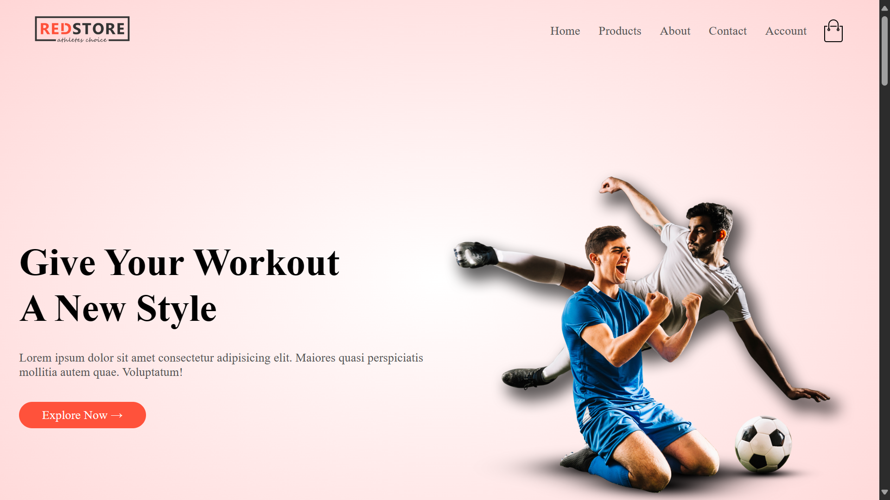
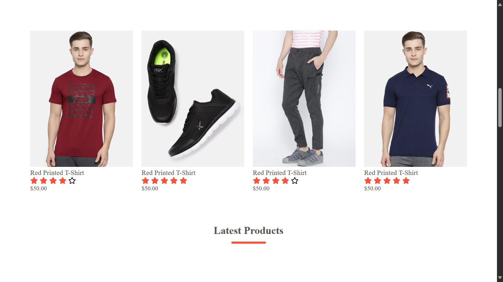
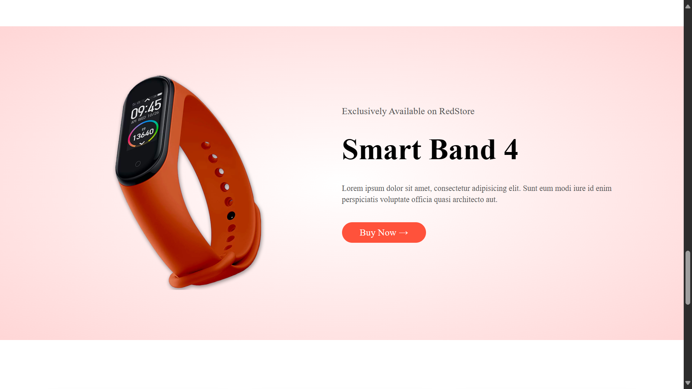

# Red-Store

Welcome to Red-Store, an e-commerce shopping website designed for a seamless and enjoyable online shopping experience.

## About
Red-Store is a simple yet functional e-commerce platform where users can browse and purchase products. This project demonstrates basic e-commerce functionalities and user-friendly design.

## Project URL
Check out the live version of the project here: [Red-Store](https://red-store-shopping.netlify.app/)

## Screenshots
Here are some screenshots showcasing Red-Store:

## Technologies Used
- **HTML**
- **CSS**

## Installation and Setup
To run this project locally, follow these steps:
1. Clone the repository: `git clone https://github.com/Bilal00404/Red-Store.git`
2. Navigate to the project directory: `cd Red-Store`
3. Open the HTML file in your preferred browser.

## Contact
If you have any questions or suggestions, feel free to contact me at bilalchanna67@gmail.com.
